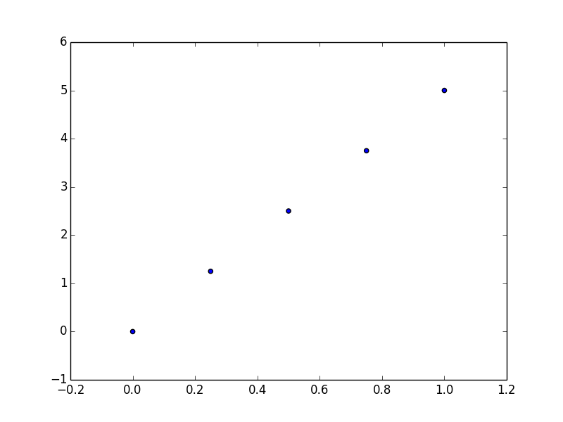
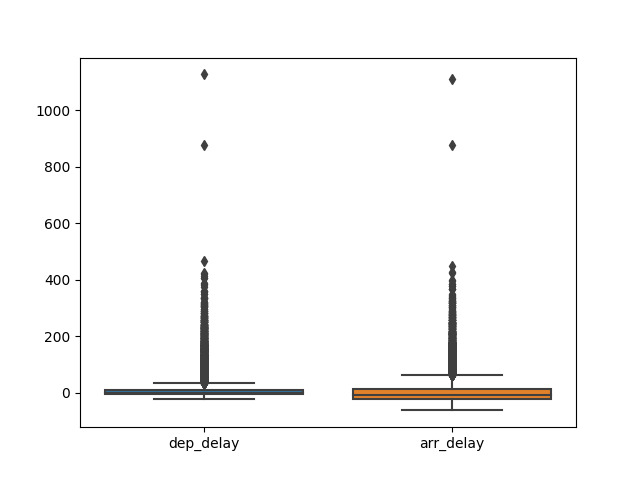

```{r echo=F}
library("feather")
library('nycflights13')
flights_csv <- nycflights13::flights
write.csv(nycflights13::flights, file = "flights.csv")
```


```{python echo=T, eval=F, include=T, engine.path="C:/Users/Steve/Anaconda3/python"}
import pandas
import csv
import feather
import wordcloud

# Read flights data and select flights to O'Hare
flights = pandas.read_csv("flights.csv")
flights = flights[flights['dest'] == "ORD"]

# Select carrier and delay columns and drop rows with missing values
flights = flights[['carrier', 'dep_delay', 'arr_delay']]
flights = flights.dropna()
print(flights[:5])

# Write to feather file for reading from R    
feather.write_dataframe(flights, "flights.feather")

## or as a csv
with open("flights2.csv", "w", newline='') as csv_file:
        writer = csv.writer(csv_file, delimiter=',')
        for line in flights:
            writer.writerow(line)
```


```{r}
library(feather) 
library(ggplot2)

# Read from feather and plot
flights <- read_feather(path = "./flights.feather")

#
p <- ggplot(flights, aes(carrier, arr_delay)) + geom_point() + geom_jitter()
p
```


```{python echo=T, eval=F, include=T, engine.path="C:/Users/Steve/Anaconda3/python"}
import pandas as pd
import numpy as np
from matplotlib import pyplot as plt
import seaborn as sns

# Read flights data and select flights to O'Hare
flights = pd.read_csv("flights.csv")
flights = flights[flights['dest'] == "ORD"]

# Select carrier and delay columns and drop rows with missing values
flights = flights[['carrier', 'dep_delay', 'arr_delay']]
flights = flights.dropna()
temp = flights.drop(['carrier'], axis=1)

sns.boxplot(data=temp)
plt.savefig("planes2.png")
```


    