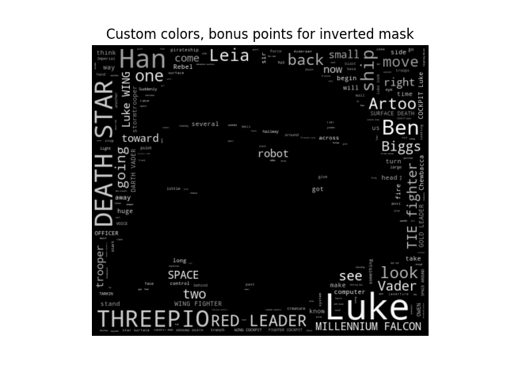
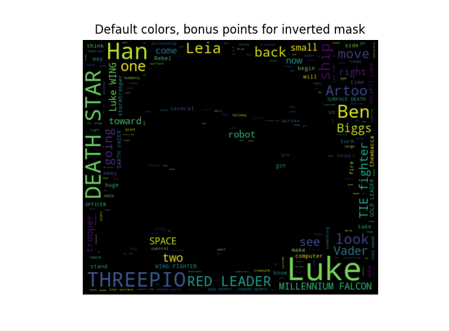

```{r setup, include=F}
library(knitr)
```

In this second version of HW9, I create two word clouds that utilize the shape of an image as the structure. Here is the code, adapted from the GitHub "amueller": https://github.com/amueller/word_cloud/tree/master/examples

```{python, echo=T, engine.path="C:/Users/Steve/Anaconda3/python"}
"""
Using custom colors
===================
Using the recolor method and custom coloring functions.
"""

import numpy as np
from PIL import Image
from os import path
import matplotlib.pyplot as plt
import random

from wordcloud import WordCloud, STOPWORDS


def grey_color_func(word, font_size, position, orientation, random_state=None,
                    **kwargs):
    return "hsl(0, 0%%, %d%%)" % random.randint(60, 100)

d = path.dirname("a_new_hope.txt")

# read the mask image
# taken from
# http://www.stencilry.org/stencils/movies/star%20wars/storm-trooper.gif
mask = np.array(Image.open(path.join(d, "stormtrooper_mask.png")))

# movie script of "a new hope"
# http://www.imsdb.com/scripts/Star-Wars-A-New-Hope.html
# May the lawyers deem this fair use.
text = open(path.join(d, 'a_new_hope.txt')).read()

# preprocessing the text a little bit
text = text.replace("HAN", "Han")
text = text.replace("LUKE'S", "Luke")

# adding movie script specific stopwords
stopwords = set(STOPWORDS)
stopwords.add("int")
stopwords.add("ext")

wc = WordCloud(max_words=1000, mask=mask, stopwords=stopwords, margin=10,
               random_state=1).generate(text)
# store default colored image
default_colors = wc.to_array()
plt.title("Custom colors, bonus points for inverted mask")
plt.imshow(wc.recolor(color_func=grey_color_func, random_state=3),
           interpolation="bilinear")
wc.to_file("a_new_hope.png")
plt.axis("off")
plt.figure()
plt.title("Default colors, bonus points for inverted mask")
plt.imshow(default_colors, interpolation="bilinear")
plt.axis("off")
plt.show()

```

As a result of this code, two word clouds are created, one in grayscale and one with color. The two images are saved locally and then presented using _knitr_. Here are my two pictures:

```{r pics, echo=F}


```